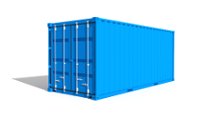

# containit

A simple process manager that monitors a group of processes that are related to
a project.

| [Latest][tag-link] | [License][lic-link] |
| :----------------: | :-----------------: |
| ![tag-badge]       | ![lic-badge]        |

[lic-badge]: https://img.shields.io/github/license/shanebarnes/containit.svg "License"
[lic-link]: https://github.com/shanebarnes/containit/blob/master/LICENSE.md "License"
[tag-badge]: https://img.shields.io/github/tag/shanebarnes/containit.svg "Latest"
[tag-link]: https://github.com/shanebarnes/containit/releases "Latest"

## Build Status

| [Linux][lin-link] | [Macintosh][mac-link] | [Windows][win-link] |
| :---------------: | :-------------------: | :-----------------: |
| ![lin-badge]      | ![mac-badge]          | ![win-badge]        |

[lin-badge]: https://travis-ci.org/shanebarnes/containit.svg?branch=master "Travis build status"
[lin-link]:  https://travis-ci.org/shanebarnes/containit "Travis build status"
[mac-badge]: https://travis-ci.org/shanebarnes/containit.svg?branch=master "Travis build status"
[mac-link]:  https://travis-ci.org/shanebarnes/containit "Travis build status"
[win-badge]: https://ci.appveyor.com/api/projects/status/87pc6w07pqgwhax8/branch/master "AppVeyor build status"
[win-link]:  https://ci.appveyor.com/project/shanebarnes/containit/branch/master "AppVeyor build status"

## Synopsis

containit is a process manager that waits for one or more child processes to
complete. Each child process is not expected to exit unless a fatal error
condition is encountered. Termination of a single child process will cause
containit to kill all remaining child processes and stop or restart immediately.

## Example

./containit stop-on-term "/bin/cat" "/bin/sleep 3"

./containit restart-on-term "/bin/cat" "/bin/sleep 3" "/bin/date"

./containit restart-on-term "/usr/sbin/nginx -g 'daemon off;'"

## Motivation

containit was designed to be run as a single Docker container process
(i.e., init process) that executes one or more child processes.
